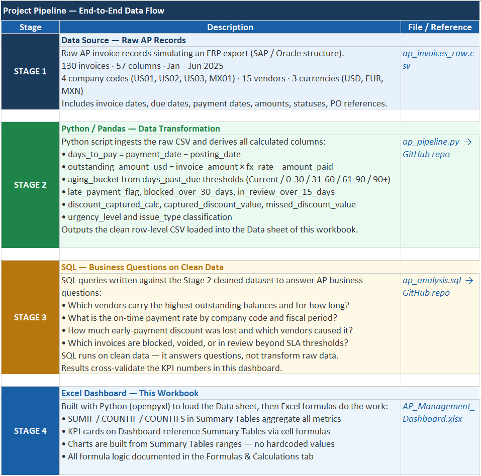
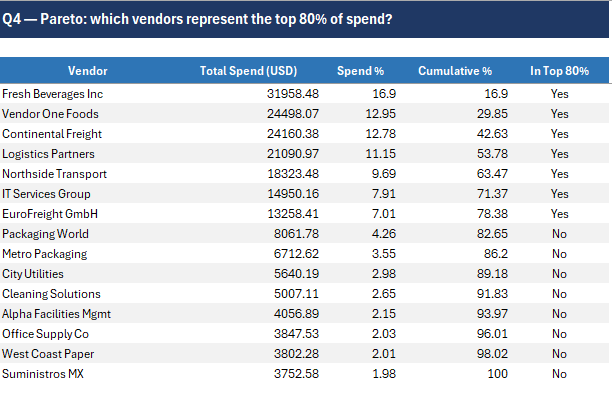
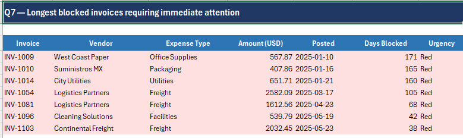
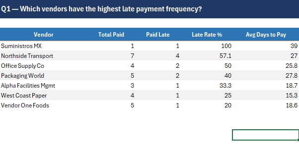

# AP Management Dashboard

End-to-end Accounts Payable analytics project built to simulate a real business reporting workflow from raw ERP-style invoice data to management-facing KPI reporting.

## Dashboard Preview

## Workflow View

## Key Files

- [Final Excel Dashboard Workbook](AP_Management_Dashboard.xlsx)
- [Project Pipeline View](images/project-pipeline.png)
- [SQL Spend Concentration Analysis](images/sql-q4-pareto-top-80-spend.png)
- [SQL Blocked Invoices Analysis](images/sql-q7-blocked-invoices-attention.png)
- [SQL Late Payment Frequency Analysis](images/sql-q1-late-payment-frequency.png)

## Project Overview

This project was designed to demonstrate how Accounts Payable data can move through a full reporting pipeline:

- **Python** prepares and transforms raw invoice data
- **SQL** answers business questions on the cleaned dataset
- **Excel** presents the final KPIs and dashboard views for reporting

The final output is an Excel dashboard focused on invoice volume, payment status, aging, vendor activity, and payment-performance analysis.

## Business Goal

The goal of this project is to show practical finance-operations and reporting capability in a way that is relevant to Accounts Payable, finance operations, shared services, and analyst roles.

Rather than showing only spreadsheet formatting, this project demonstrates a more complete workflow:

**raw data -> transformation -> analysis -> dashboard reporting**

## Tools Used

- **Python** for data transformation and preparation
- **SQL** for business-question analysis on cleaned AP data
- **Excel** for KPI reporting, summary tables, formulas, and dashboard presentation

## SQL Analysis Examples

To support the reporting layer, I used SQL to answer practical Accounts Payable business questions around vendor concentration, payment behavior, and invoice exceptions. These queries helped bridge the gap between transformed ERP-style data and management-facing Excel reporting.

### 1) Spend concentration analysis — top 80% of vendor spend

This query applies a Pareto-style view to identify which vendors represent the top 80% of total spend. It helps highlight vendor concentration and supports prioritization in supplier oversight and spend analysis.

### 2) Blocked invoices requiring immediate attention

This query surfaces the longest blocked invoices by age, amount, and urgency. It is designed to support exception handling and help identify invoices that may require immediate operational follow-up.

### 3) Vendors with highest late payment frequency

This query measures which vendors show the highest frequency of late payments, along with average payment timing. It helps evaluate payment discipline and identify recurring patterns at the vendor level.

## What the Dashboard Tracks 

The dashboard is designed to support common AP and finance reporting needs, including:

- Invoice volume trends
- Vendor-level activity
- Aging bucket analysis
- Payment status tracking
- Overdue exposure
- On-time payment performance
- Review and blocked invoice monitoring

## Project Structure

- `AP_Management_Dashboard.xlsx` — final Excel dashboard workbook
- `data/` — source and supporting data files
- `scripts/` — Python and SQL logic used in the pipeline
- `output/` — generated outputs and analysis results
- `images/` — dashboard, workflow, and SQL analysis image assets

## Why This Project Matters

This project reflects the kind of work behind real finance reporting:

- turning raw transactional data into usable information
- checking business logic across multiple steps
- connecting operational AP activity to decision-useful reporting
- presenting results in a format that non-technical stakeholders can use

It was built as a portfolio project to demonstrate a blend of:

- Accounts Payable domain knowledge
- process thinking
- reporting discipline
- modern analytics tools

## Final Deliverable

The main deliverable in this repository is:

**`AP_Management_Dashboard.xlsx`**

This workbook includes the final dashboard plus supporting tabs documenting the project pipeline, formula logic, and analysis structure.
